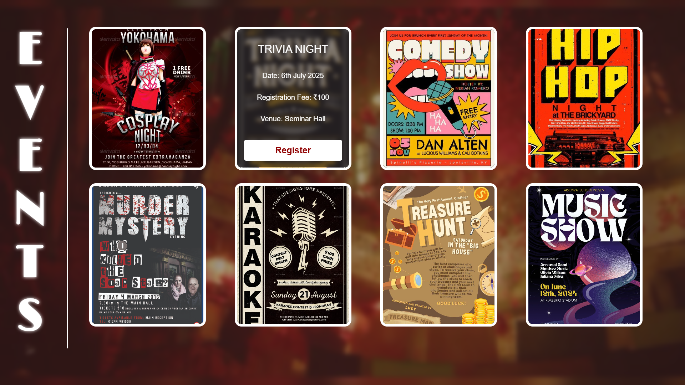

# Event Cards

This project displays a series of stylized event cards with images, interactive hover effects, and animated elements. Each card reveals event details such as title, date, venue, and a registration button on hover. A fixed vertical heading adds a creative flair, while a blurred overlay enhances readability against the background. The layout uses modern CSS Grid for responsiveness and clean structure.

# Features

- Modern card design with image backgrounds  
- Smooth hover animations revealing event info  
- Fully responsive layout using CSS Grid  
- Blurred background overlay with fixed vertical title  

# Technologies Used

- HTML
- CSS (Flexbox & Grid)  

# Preview

## 🔗 Live Demo

[Click here to try the live demo 🚀](https://the-real-protagonist.github.io/events/)

##  License

Free to use for personal and educational purposes.

